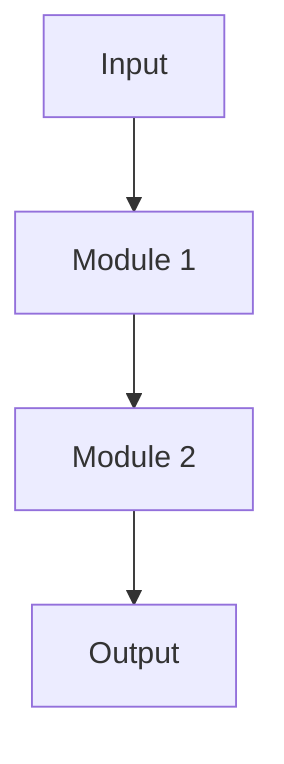
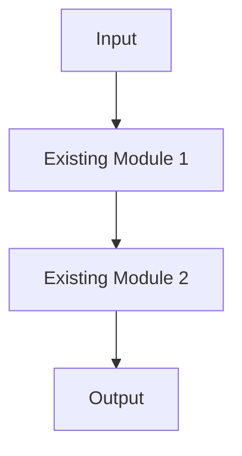
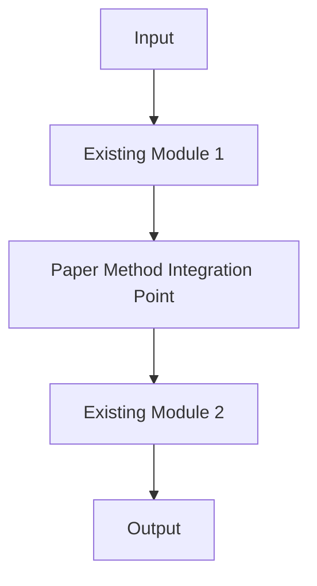

# Paper Analysis Report: {Title}

## Basic Information

- **arXiv ID**: {arxiv_id}
- **Published**: {published_date}
- **Authors**: {authors}
- **Categories**: {categories}
- **Project Homepage**: {project_homepage} (if available)

## Abstract

**Core Innovation**: {one_sentence_summary}

{original_abstract}

## Motivation Analysis

{Analyze the core problem the paper aims to solve and the driving forces, including:}
- Limitations of existing methods
- Key problems to be addressed
- Necessity and importance of the research

## Main Contributions Analysis

1. **{Contribution 1 Title}**
   - {Detailed description}
   - {Technical details}
   - {Innovation aspects}

2. **{Contribution 2 Title}**
   - {Detailed description}
   - {Technical details}
   - {Innovation aspects}

3. **{Contribution 3 Title}**
   - {Detailed description}
   - {Technical details}
   - {Innovation aspects}

{Add more contributions as needed}

## In-depth Technical Analysis

### 1. Core Architecture

{Describe the core architecture proposed in the paper, including:}
- Overall architecture diagram (using Mermaid or text description)
- Module functionalities
- Inter-module interactions

### 2. Key Algorithms

{Describe core algorithms in detail, including:}
- Algorithm pseudocode or mathematical formulas
- Algorithm complexity analysis
- Comparison with existing methods

### 3. Implementation Details

{Describe important implementation details, including:}
- Data preprocessing methods
- Model training strategies
- Hyperparameter settings
- Optimization techniques

### 4. Technical Innovations

{Highlight technical innovations in the paper, including:}
- Novel design ideas
- Unique technical approaches
- Innovative application methods

## Experimental Design and Validation Analysis

### Core Claims

{Core hypotheses and main claims of the paper, such as:}
- Hypothesis 1: {description}
- Hypothesis 2: {description}
- Main claim: {description}

### Datasets and Baselines

**Datasets**:
- {Dataset name 1}: {scale, characteristics, purpose}
- {Dataset name 2}: {scale, characteristics, purpose}

**Baseline Methods**:
- {Baseline 1}: {brief description}
- {Baseline 2}: {brief description}

**Experimental Setup**:
- Hardware: {GPU model, quantity, etc.}
- Software: {framework versions, dependencies, etc.}

### Evaluation Metrics

{Describe evaluation metrics and their rationale:}
- **{Metric 1}**: {definition, calculation method, why chosen}
- **{Metric 2}**: {definition, calculation method, why chosen}

### Experimental Results

{Summarize main experimental results, including:}

**Main Results Table**:

| Method | {Metric 1} | {Metric 2} | {Metric 3} |
|--------|------------|------------|------------|
| {Baseline 1} | {value} | {value} | {value} |
| {Baseline 2} | {value} | {value} | {value} |
| **Proposed** | **{value}** | **{value}** | **{value}** |

**Key Findings**:
1. {Finding 1}
2. {Finding 2}
3. {Finding 3}

### Ablation Studies

{If the paper includes ablation studies, describe:}
- Experimental design
- Contribution of each component
- Key component analysis

### Conclusions and Quantitative Analysis

{Conclusions based on experimental results and key quantitative analysis:}
- Performance improvement magnitude
- Statistical significance
- Comparison with theoretical expectations
- Limitation analysis

## Project Fit Assessment

> **Note**: Only included when `depth=medium` or `depth=deep`

### Relevance Score: {X}/10

{Assess the relevance of the paper to the current project, considering:}
- Technology stack overlap
- Application scenario similarity
- Implementation feasibility
- Expected benefits

### Technology Overlap

**Current Project Tech Stack**:
- {Tech 1}
- {Tech 2}
- {Tech 3}

**Paper Technologies**:
- {Tech 1}
- {Tech 2}
- {Tech 3}

**Overlap Analysis**:
{Analyze which technologies can be directly reused and which need adaptation}

### Potential Applications

1. **{Application Scenario 1}**
   - Application method: {description}
   - Expected effect: {description}
   - Implementation difficulty: {Low/Medium/High}

2. **{Application Scenario 2}**
   - Application method: {description}
   - Expected effect: {description}
   - Implementation difficulty: {Low/Medium/High}

## Implementation Suggestions

### Short-term Suggestions (1-2 weeks)

1. **{Suggestion 1}**
   - Specific steps: {description}
   - Required resources: {description}
   - Expected output: {description}

2. **{Suggestion 2}**
   - Specific steps: {description}
   - Required resources: {description}
   - Expected output: {description}

### Medium-term Suggestions (1-2 months)

1. **{Suggestion 1}**
   - Specific steps: {description}
   - Required resources: {description}
   - Expected output: {description}

### Long-term Suggestions (3+ months)

1. **{Suggestion 1}**
   - Specific steps: {description}
   - Required resources: {description}
   - Expected output: {description}

## Reproduction Status

- **Status**: {success/failed/partial/not_attempted}
- **Method**: {official_repo/self_implemented/none}
- **Repository URL**: {URL or "not found"}
- **Iterations**: {N times}
- **Success Rate**: {X%}
- **Notes**: {detailed explanation}

### Reproduction Process

{If code reproduction was performed, describe:}
1. **Iteration 1**: {attempt content, problems encountered, solutions}
2. **Iteration 2**: {attempt content, problems encountered, solutions}
...

### Reproduction Results

{If reproduction succeeded, provide:}
- Run commands
- Output results
- Performance comparison
- Code path: `./alpha-sight/sandbox/{arxiv_id}_reproduction/`

## Architecture Comparison

{Use Mermaid diagrams to compare paper method with current project architecture}

### Paper Architecture

### Current Project Architecture

### Integration Plan

## Related Papers

{If citation data available, list related papers:}

1. **{Paper Title 1}** (arXiv:{id})
   - Relationship: {cites/cited_by/related}
   - Summary: {one-sentence description}

2. **{Paper Title 2}** (arXiv:{id})
   - Relationship: {cites/cited_by/related}
   - Summary: {one-sentence description}

## Citation Information

- **Cited by**: {count} (as of {date})
- **References**: {count}
- **Semantic Scholar**: {URL}
- **arXiv**: https://arxiv.org/abs/{arxiv_id}

## Tags

{tags_list}

---

**Report Generated**: {timestamp}
**Analysis Depth**: {depth}
**Generated by**: Alpha-Sight v1.0
**PDF Path**: `./alpha-sight/papers/{arxiv_id}.pdf`
