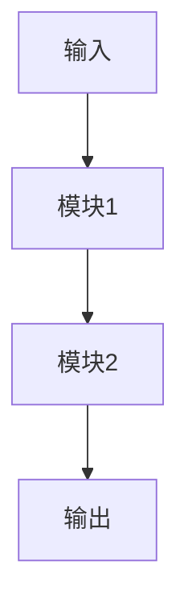
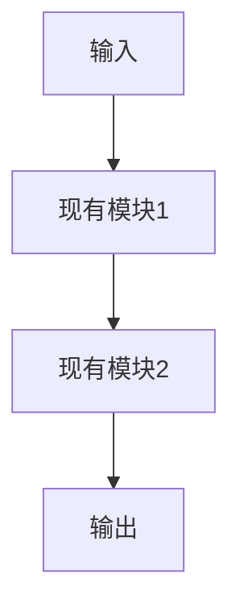
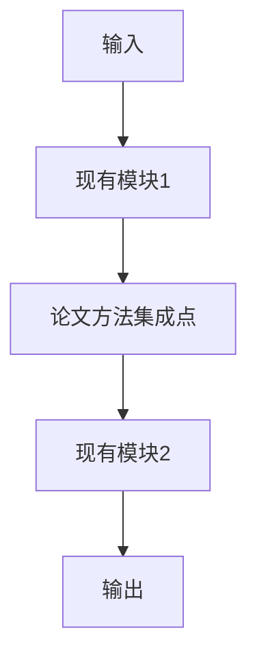

# 论文深度分析报告：{Title}

## 基本信息
- **arXiv ID**: {arxiv_id}
- **发布日期**: {published_date}
- **作者**: {authors}
- **分类**: {categories}
- **项目主页**: {project_homepage} (如果有)

## 摘要

**核心创新点**: {one_sentence_summary}

{abstract_in_chinese_if_needed}

## 论文的Motivation分析

{分析论文想要解答的核心问题以及驱动解决问题的动力。包括：}
- 现有方法的局限性
- 待解决的关键问题
- 研究的必要性和重要性

## 论文的主要贡献点分析

1. **{贡献点1标题}**
   - {详细描述}
   - {技术细节}
   - {创新之处}

2. **{贡献点2标题}**
   - {详细描述}
   - {技术细节}
   - {创新之处}

3. **{贡献点3标题}**
   - {详细描述}
   - {技术细节}
   - {创新之处}

{根据实际情况添加更多贡献点}

## 技术细节深度分析

### 1. 核心架构

{描述论文提出的核心架构设计，包括：}
- 整体架构图（使用 Mermaid 或文字描述）
- 各模块功能
- 模块间交互关系

### 2. 关键算法

{详细描述核心算法，包括：}
- 算法伪代码或数学公式
- 算法复杂度分析
- 与现有方法的对比

### 3. 实现细节

{描述重要的实现细节，包括：}
- 数据预处理方法
- 模型训练策略
- 超参数设置
- 优化技巧

### 4. 技术创新点

{突出论文的技术创新，包括：}
- 新颖的设计思路
- 独特的技术手段
- 创新的应用方式

## 实验设计与验证分析

### 核心主张

{论文的核心假设和主要声明，例如：}
- 假设1：{描述}
- 假设2：{描述}
- 主要声明：{描述}

### 数据集与基线

**数据集**:
- {数据集名称1}: {规模、特点、用途}
- {数据集名称2}: {规模、特点、用途}

**基线方法**:
- {基线方法1}: {简要描述}
- {基线方法2}: {简要描述}

**实验环境**:
- 硬件: {GPU型号、数量等}
- 软件: {框架版本、依赖库等}

### 评价指标

{描述使用的评价指标及其合理性：}
- **{指标1}**: {定义、计算方法、为何选择}
- **{指标2}**: {定义、计算方法、为何选择}

### 实验结果

{总结主要实验结果，包括：}

**主要结果表格**:

| 方法 | {指标1} | {指标2} | {指标3} |
|------|---------|---------|---------|
| {基线1} | {值} | {值} | {值} |
| {基线2} | {值} | {值} | {值} |
| **本文方法** | **{值}** | **{值}** | **{值}** |

**关键发现**:
1. {发现1}
2. {发现2}
3. {发现3}

### 消融实验

{如果论文包含消融实验，描述：}
- 实验设计
- 各组件的贡献
- 关键组件分析

### 结论和定量分析

{基于实验结果的结论和关键定量分析：}
- 性能提升幅度
- 统计显著性
- 与理论预期的对比
- 局限性分析

## 项目契合度评估

> **注意**: 仅在 `depth=medium` 或 `depth=deep` 时包含此章节

### 相关性评分：{X}/10

{评估论文与当前项目的相关性，考虑：}
- 技术栈重叠度
- 应用场景相似度
- 实施可行性
- 预期收益

### 技术重叠

**当前项目技术栈**:
- {技术1}
- {技术2}
- {技术3}

**论文使用技术**:
- {技术1}
- {技术2}
- {技术3}

**重叠分析**:
{分析哪些技术可以直接复用，哪些需要适配}

### 潜在应用

1. **{应用场景1}**
   - 应用方式: {描述}
   - 预期效果: {描述}
   - 实施难度: {低/中/高}

2. **{应用场景2}**
   - 应用方式: {描述}
   - 预期效果: {描述}
   - 实施难度: {低/中/高}

## 实施建议

### 短期建议（1-2周）

1. **{建议1}**
   - 具体步骤: {描述}
   - 所需资源: {描述}
   - 预期产出: {描述}

2. **{建议2}**
   - 具体步骤: {描述}
   - 所需资源: {描述}
   - 预期产出: {描述}

### 中期建议（1-2月）

1. **{建议1}**
   - 具体步骤: {描述}
   - 所需资源: {描述}
   - 预期产出: {描述}

### 长期建议（3月以上）

1. **{建议1}**
   - 具体步骤: {描述}
   - 所需资源: {描述}
   - 预期产出: {描述}

## 代码复现状态

- **状态**: {成功/失败/部分成功/未尝试}
- **方法**: {官方仓库/自实现/无}
- **仓库地址**: {URL或"未找到"}
- **迭代次数**: {N次}
- **成功率**: {X%}
- **备注**: {详细说明}

### 复现过程

{如果进行了代码复现，描述：}
1. **第1次迭代**: {尝试内容、遇到的问题、解决方案}
2. **第2次迭代**: {尝试内容、遇到的问题、解决方案}
...

### 复现结果

{如果复现成功，提供：}
- 运行命令
- 输出结果
- 性能对比
- 代码路径: `./alpha-sight/sandbox/{arxiv_id}_reproduction/`

## 架构对比

{使用 Mermaid 图表对比论文方法与当前项目架构}

### 论文架构

### 当前项目架构

### 集成方案

## 相关论文

{如果有引用数据，列出相关论文：}

1. **{论文标题1}** (arXiv:{id})
   - 关系: {引用/被引用/相关}
   - 简介: {一句话描述}

2. **{论文标题2}** (arXiv:{id})
   - 关系: {引用/被引用/相关}
   - 简介: {一句话描述}

## 引用信息

- **被引用次数**: {count} (截至 {date})
- **参考文献数**: {count}
- **Semantic Scholar**: {URL}
- **arXiv**: https://arxiv.org/abs/{arxiv_id}

## 标签

{tags_list}

---

**报告生成时间**: {timestamp}
**分析深度**: {depth}
**生成工具**: Alpha-Sight v1.0
**PDF路径**: `./alpha-sight/papers/{arxiv_id}.pdf`
