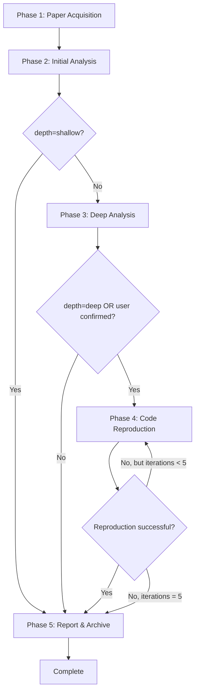

# Workflow Details

This document provides detailed workflows for Phases 2-5 of the Alpha-Sight paper analysis process.

## Table of Contents

- [Phase 2: Initial Analysis](#phase-2-initial-analysis)
- [Phase 3: Deep Analysis](#phase-3-deep-analysis)
- [Phase 4: Code Reproduction](#phase-4-code-reproduction)
- [Phase 5: Report Generation & Archiving](#phase-5-report-generation--archiving)

## Phase 2: Initial Analysis

**Trigger**: Automatically after Phase 1 (Paper Acquisition) completes

**Duration**: 2-5 minutes

### Step 1: Extract Key Information

**From arXiv Metadata**:
- Title
- Authors (full list)
- Abstract
- Published date
- Updated date (if different)
- Categories (e.g., cs.LG, cs.AI)
- PDF URL

**From PDF** (if needed):
- Project homepage
- Code repository links
- Key contributions (3-5 bullet points from introduction/abstract)

**Tools**:
- Read tool for PDF
- WebFetch for arXiv API (if not already fetched)

**Output**: Structured metadata dictionary

### Step 2: Fetch Citation Data

**Only if `SEMANTIC_SCHOLAR_API_KEY` is available**

**API Call**:
```python
url = f"https://api.semanticscholar.org/graph/v1/paper/arXiv:{arxiv_id}"
params = {
    "fields": "citationCount,referenceCount,citations,references,influentialCitationCount"
}
headers = {
    "x-api-key": SEMANTIC_SCHOLAR_API_KEY  # if available
}
```

**Extract**:
- `citationCount` - Number of papers citing this paper
- `referenceCount` - Number of papers this paper cites
- `citations` - List of citing papers (top 10)
- `references` - List of referenced papers (top 10)
- `influentialCitationCount` - Highly influential citations

**Fallback**: If API fails or key unavailable, continue without citation data

**Tools**:
- WebFetch for Semantic Scholar API
- Or use `scripts/semantic_scholar_fetcher.py`

### Step 3: Generate Initial Report

**Create Report File**: `./alpha-sight/reports/{arxiv_id}_analysis.md`

**Include**:
- Basic information section
- Abstract section
- Key contributions (brief)
- Citation information (if available)
- Placeholder sections for deeper analysis

**Template**: Use simplified version from `references/report_templates.md`

**Tools**:
- Write tool to create report file
- Or use `scripts/report_generator.py --depth shallow`

### Phase 2 Output

- Report file created at `./alpha-sight/reports/{arxiv_id}_analysis.md`
- Metadata ready for Phase 3
- Citation data cached (if available)

---

## Phase 3: Deep Analysis

**Trigger**: Automatically after Phase 2, unless `depth=shallow`

**Duration**: 5-15 minutes depending on paper complexity

**Skip Condition**: If `depth=shallow`, skip to Phase 5

### Step 1: Read Paper Content

**Target Sections**:
1. **Introduction** - Understand motivation and contributions
2. **Related Work** - Identify positioning and novelty
3. **Method/Approach** - Core technical content
4. **Algorithm** - Detailed algorithmic descriptions
5. **Implementation** - Implementation details
6. **Experiments** - Experimental setup and results

**Reading Strategy**:
```python
# Read PDF with focus on key sections
pdf_content = read_pdf(f"./alpha-sight/papers/{arxiv_id}.pdf")

# Extract sections using pattern matching
sections = {
    "introduction": extract_section(pdf_content, ["Introduction", "1."]),
    "method": extract_section(pdf_content, ["Method", "Approach", "Methodology"]),
    "algorithm": extract_section(pdf_content, ["Algorithm", "Procedure"]),
    "implementation": extract_section(pdf_content, ["Implementation", "Details"]),
    "experiments": extract_section(pdf_content, ["Experiments", "Results", "Evaluation"])
}
```

**Tools**: Read tool for PDF

### Step 2: Analyze Current Project

**Identify Tech Stack**:

```python
# Find package managers and config files
tech_indicators = {
    "python": ["requirements.txt", "pyproject.toml", "setup.py", "Pipfile"],
    "javascript": ["package.json", "yarn.lock", "pnpm-lock.yaml"],
    "rust": ["Cargo.toml"],
    "go": ["go.mod"],
    "java": ["pom.xml", "build.gradle"]
}

# Use Glob to find these files
for lang, files in tech_indicators.items():
    for file_pattern in files:
        matches = glob(f"**/{file_pattern}")
        if matches:
            tech_stack[lang] = read_config(matches[0])
```

**Search for Relevant Patterns**:

```python
# Extract key technical terms from paper
paper_keywords = extract_keywords(sections["method"])

# Search codebase for these patterns
for keyword in paper_keywords:
    matches = grep(keyword, output_mode="files_with_matches")
    if matches:
        relevant_files.append(matches)
```

**Read Key Configuration Files**:
- Framework configurations
- Model architectures
- Training scripts
- Data processing pipelines

**Tools**: Glob (find files), Grep (search patterns), Read (config files)

### Step 3: Generate Project Fit Assessment

**Calculate Relevance Score (1-10)**:

```python
score = 0

# Tech stack overlap (0-3 points)
if paper_uses_same_framework:
    score += 3
elif paper_uses_compatible_framework:
    score += 2
elif paper_uses_different_but_portable:
    score += 1

# Problem domain overlap (0-3 points)
if paper_solves_exact_problem:
    score += 3
elif paper_solves_related_problem:
    score += 2
elif paper_solves_tangentially_related:
    score += 1

# Implementation feasibility (0-2 points)
if easy_to_implement:
    score += 2
elif moderate_effort:
    score += 1

# Expected impact (0-2 points)
if high_impact:
    score += 2
elif moderate_impact:
    score += 1

relevance_score = score
```

**Identify Application Scenarios**:
- Where in the current project could this be applied?
- What specific problems could it solve?
- What improvements could it bring?

**Generate Specific Suggestions**:
- Short-term: Quick wins, low-hanging fruit
- Medium-term: Moderate effort, significant impact
- Long-term: Major refactoring, strategic improvements

### Step 4: Create Architecture Comparison

**Generate Mermaid Diagrams**:

```markdown
### Paper Architecture

\`\`\`mermaid
graph TD
    A[Input Data] --> B[Preprocessing]
    B --> C[Model Component 1]
    C --> D[Model Component 2]
    D --> E[Output]
\`\`\`

### Current Project Architecture

\`\`\`mermaid
graph TD
    A[Input Data] --> B[Current Preprocessing]
    B --> C[Current Model]
    C --> D[Output]
\`\`\`

### Proposed Integration

\`\`\`mermaid
graph TD
    A[Input Data] --> B[Current Preprocessing]
    B --> C[Paper Method Integration]
    C --> D[Current Model Enhanced]
    D --> E[Output]

    style C fill:#90EE90
\`\`\`
```

**Highlight Integration Points**:
- Where to inject paper's method
- What needs to be modified
- What can remain unchanged

### Step 5: Ask User for Reproduction

**If `depth=medium`**:

```python
response = AskUserQuestion(
    questions=[{
        "question": "Would you like to reproduce the code from this paper?",
        "header": "Reproduction",
        "options": [
            {
                "label": "Yes, reproduce code",
                "description": "Attempt to find and run official code, or implement from scratch"
            },
            {
                "label": "No, analysis only",
                "description": "Skip code reproduction and proceed to report generation"
            }
        ],
        "multiSelect": false
    }]
)

if response == "Yes, reproduce code":
    proceed_to_phase_4 = True
else:
    skip_to_phase_5 = True
```

**If `depth=deep`**:
- Skip question, automatically proceed to Phase 4

**If `depth=shallow`**:
- This phase is skipped entirely

### Phase 3 Output

- Detailed analysis sections added to report
- Project fit assessment with relevance score
- Architecture comparison diagrams
- Specific implementation suggestions
- Decision on whether to proceed to Phase 4

---

## Phase 4: Code Reproduction

**Trigger**: User confirmed OR `depth=deep`

**Duration**: 10-30 minutes depending on complexity

**Skip Condition**: User declined OR `depth=shallow` OR `depth=medium` without confirmation

### Step 1: Find Official Repository

**Search Strategy** (in order):

#### 1.1 Check arXiv Page

```python
arxiv_page_url = f"https://arxiv.org/abs/{arxiv_id}"
page_content = webfetch(arxiv_page_url, "Find code repository links")

# Look for common patterns
code_patterns = [
    r"github\.com/[\w-]+/[\w-]+",
    r"gitlab\.com/[\w-]+/[\w-]+",
    r"Code:\s*(https?://[^\s]+)",
    r"Implementation:\s*(https?://[^\s]+)"
]

for pattern in code_patterns:
    matches = re.findall(pattern, page_content)
    if matches:
        repo_url = matches[0]
        break
```

#### 1.2 Parse PDF for URLs

```python
pdf_text = read_pdf(f"./alpha-sight/papers/{arxiv_id}.pdf")

# Search for GitHub/GitLab URLs in PDF
url_patterns = [
    r"https?://github\.com/[\w-]+/[\w-]+",
    r"https?://gitlab\.com/[\w-]+/[\w-]+",
    r"https?://bitbucket\.org/[\w-]+/[\w-]+"
]

for pattern in url_patterns:
    matches = re.findall(pattern, pdf_text)
    if matches:
        repo_url = matches[0]
        break
```

#### 1.3 Query Semantic Scholar

```python
if SEMANTIC_SCHOLAR_API_KEY:
    url = f"https://api.semanticscholar.org/graph/v1/paper/arXiv:{arxiv_id}"
    params = {"fields": "externalIds,url"}
    response = webfetch(url, params)

    if response.get("externalIds", {}).get("GitHub"):
        repo_url = f"https://github.com/{response['externalIds']['GitHub']}"
```

#### 1.4 Search Papers with Code

```python
pwc_url = f"https://paperswithcode.com/api/v1/papers/?arxiv_id={arxiv_id}"
response = webfetch(pwc_url, "Find code implementations")

if response.get("results"):
    repo_url = response["results"][0].get("official_code_url")
```

### Step 2a: Official Repository Found

**Setup Sandbox**:

```bash
# Create sandbox directory
mkdir -p "./alpha-sight/sandbox/${arxiv_id}_reproduction"
cd "./alpha-sight/sandbox/${arxiv_id}_reproduction"

# Clone repository
git clone ${repo_url} official_repo
cd official_repo

# Check for dependency files
if [ -f "requirements.txt" ]; then
    dep_file="requirements.txt"
elif [ -f "environment.yml" ]; then
    dep_file="environment.yml"
elif [ -f "pyproject.toml" ]; then
    dep_file="pyproject.toml"
elif [ -f "setup.py" ]; then
    dep_file="setup.py"
fi
```

**Create Virtual Environment**:

```bash
# Use uv for fast dependency management
uv venv .venv

# Activate (Windows)
.venv\Scripts\activate

# Activate (Unix)
source .venv/bin/activate
```

**Install Dependencies**:

```bash
# Install based on dependency file
if [ "$dep_file" = "requirements.txt" ]; then
    uv pip install -r requirements.txt
elif [ "$dep_file" = "environment.yml" ]; then
    # Convert conda env to requirements
    conda env export --from-history > requirements.txt
    uv pip install -r requirements.txt
elif [ "$dep_file" = "pyproject.toml" ]; then
    uv pip install -e .
elif [ "$dep_file" = "setup.py" ]; then
    uv pip install -e .
fi
```

**Run with Timeout**:

```bash
# Find main script
main_script=$(find . -name "main.py" -o -name "run.py" -o -name "train.py" | head -1)

if [ -n "$main_script" ]; then
    # Run with timeout based on depth
    timeout ${TIMEOUT_LIMITS[depth]} python $main_script
fi
```

**Record Results**:
- Success/failure status
- Output logs
- Error messages
- Performance metrics (if available)

### Step 2b: No Official Repository - Self-Implementation

**Maximum 5 iterations**

#### Iteration Loop

```python
for iteration in range(1, 6):
    print(f"=== Iteration {iteration}/5 ===")

    # 1. Read paper method section
    method_content = read_paper_section(
        pdf_path=f"./alpha-sight/papers/{arxiv_id}.pdf",
        sections=["Method", "Algorithm", "Implementation", "Approach"]
    )

    # 2. Identify required libraries
    required_libs = extract_dependencies(method_content)
    # Examples: pytorch, tensorflow, jax, numpy, scipy, transformers, etc.

    # 3. Query Context7 for documentation (if available)
    docs = {}
    if context7_available:
        for lib in required_libs:
            try:
                lib_id = resolve_library_id(lib, query=method_content)
                lib_docs = query_docs(lib_id, query=f"How to implement {key_algorithm}")
                docs[lib] = lib_docs
            except:
                # Context7 unavailable or library not found
                continue

    # 4. Generate implementation code
    code = generate_implementation(
        paper_content=method_content,
        documentation=docs,
        previous_errors=errors_from_last_iteration if iteration > 1 else None,
        iteration=iteration
    )

    # 5. Save code to sandbox
    sandbox_path = f"./alpha-sight/sandbox/{arxiv_id}_reproduction/custom_impl/"
    os.makedirs(sandbox_path, exist_ok=True)

    with open(f"{sandbox_path}/implementation_v{iteration}.py", "w") as f:
        f.write(code)

    # 6. Create requirements.txt
    requirements = "\n".join(required_libs)
    with open(f"{sandbox_path}/requirements.txt", "w") as f:
        f.write(requirements)

    # 7. Setup virtual environment
    os.chdir(sandbox_path)
    subprocess.run(["uv", "venv", ".venv"])

    # Activate and install
    if sys.platform == "win32":
        activate_cmd = ".venv\\Scripts\\activate"
    else:
        activate_cmd = "source .venv/bin/activate"

    subprocess.run(f"{activate_cmd} && uv pip install -r requirements.txt", shell=True)

    # 8. Run with timeout and resource limits
    result = run_with_timeout(
        command=f"python implementation_v{iteration}.py",
        timeout=TIMEOUT_LIMITS[depth],
        memory_limit="4GB",
        disk_limit="2GB"
    )

    # 9. Check result
    if result.success:
        print(f"✓ Implementation successful on iteration {iteration}")
        reproduction_status = "completed"
        reproduction_method = "self_implemented"
        reproduction_iterations = iteration
        break
    else:
        print(f"✗ Iteration {iteration} failed: {result.error}")
        errors_from_last_iteration = result.error

        if iteration == 5:
            print("✗ Max iterations reached. Marking as partial completion.")
            reproduction_status = "partial"
            reproduction_method = "self_implemented"
            reproduction_iterations = 5
```

#### Context7 Query Strategy

**When to Query**:
- Specific ML/DL libraries detected (PyTorch, TensorFlow, JAX, etc.)
- Complex APIs needed (transformers, diffusers, etc.)
- Unfamiliar libraries mentioned in paper

**What to Query**:
- API usage patterns
- Best practices
- Common errors and solutions
- Code examples

**Fallback**:
- If Context7 unavailable, use built-in knowledge
- Focus on standard library usage
- Implement from first principles

#### Resource Limits

**Memory**: 4GB per sandbox
```python
# Set memory limit (Unix)
import resource
resource.setrlimit(resource.RLIMIT_AS, (4 * 1024 * 1024 * 1024, -1))
```

**Disk**: 2GB per sandbox
```python
# Monitor disk usage
import shutil
usage = shutil.disk_usage(sandbox_path)
if usage.used > 2 * 1024 * 1024 * 1024:
    raise DiskLimitExceeded()
```

**Timeout**: Based on depth parameter
- shallow: 300s (5 min)
- medium: 900s (15 min)
- deep: 1800s (30 min)

### Phase 4 Output

- Reproduction status (completed/failed/partial)
- Reproduction method (official_repo/self_implemented)
- Code location in sandbox
- Iteration count and success rate
- Detailed logs and error messages
- Performance metrics (if successful)

---

## Phase 5: Report Generation & Archiving

**Trigger**: After Phase 3 or Phase 4 completes

**Duration**: 1-2 minutes

### Step 1: Generate Final Report

**Select Template**:
```python
if language == "chinese":
    template_path = "assets/report_template_zh.md"
else:
    template_path = "assets/report_template_en.md"

template = read_file(template_path)
```

**Fill Template Variables**:
```python
report_content = template.format(
    # Basic info
    Title=metadata["title"],
    arxiv_id=metadata["arxiv_id"],
    published_date=metadata["published_date"],
    authors=", ".join(metadata["authors"]),
    categories=", ".join(metadata["categories"]),

    # Analysis
    one_sentence_summary=analysis["summary"],
    relevance_score=analysis["relevance_score"],

    # Reproduction
    status=reproduction["status"],
    method=reproduction["method"],
    iterations=reproduction["iterations"],

    # Meta
    timestamp=datetime.now().isoformat(),
    depth=depth,
    tags_list=", ".join(tags)
)
```

**Write Report**:
```python
report_path = f"./alpha-sight/reports/{arxiv_id}_analysis.md"
write_file(report_path, report_content)
```

**Or Use Script**:
```bash
python scripts/report_generator.py ${arxiv_id} \
    --language ${language} \
    --depth ${depth} \
    --metadata metadata.json \
    --analysis analysis.json \
    --reproduction reproduction.json
```

### Step 2: Update index.json

**Load Index**:
```python
from scripts.index_manager import IndexManager

manager = IndexManager()
```

**Prepare Paper Data**:
```python
paper_data = {
    "arxiv_id": arxiv_id,
    "title": metadata["title"],
    "authors": metadata["authors"],
    "published_date": metadata["published_date"],
    "analyzed_date": datetime.utcnow().isoformat() + "Z",
    "categories": metadata["categories"],
    "abstract": metadata["abstract"],

    "analysis": {
        "depth": depth,
        "language": language,
        "relevance_score": analysis["relevance_score"],
        "report_path": f"./reports/{arxiv_id}_analysis.md",
        "pdf_path": f"./papers/{arxiv_id}.pdf"
    },

    "reproduction": {
        "status": reproduction["status"],
        "method": reproduction["method"],
        "repo_url": reproduction.get("repo_url"),
        "sandbox_path": f"./sandbox/{arxiv_id}_reproduction/" if reproduction["status"] != "not_started" else None,
        "iterations": reproduction["iterations"],
        "success_rate": reproduction["success_rate"],
        "notes": reproduction["notes"]
    },

    "citations": {
        "cited_by_count": citations.get("cited_by_count", 0),
        "references_count": citations.get("references_count", 0),
        "related_papers": citations.get("related_papers", [])
    },

    "tags": tags,

    "project_impact": {
        "applicable": analysis["applicable"],
        "suggestions": analysis["suggestions"]
    }
}
```

**Add or Update**:
```python
if manager.paper_exists(arxiv_id):
    manager.update_paper(arxiv_id, paper_data)
else:
    manager.add_paper(paper_data)
```

### Step 3: Cleanup

**Based on `--cleanup` parameter**:

```python
if cleanup == "always":
    cleanup_temp_files()
elif cleanup == "on-success":
    if reproduction["status"] == "completed":
        cleanup_temp_files()
    else:
        preserve_files_for_debugging()
elif cleanup == "never":
    preserve_all_files()
```

**Cleanup Function**:
```bash
cleanup_temp_files() {
    # Remove temporary files
    rm -rf ./alpha-sight/sandbox/${arxiv_id}_reproduction/.venv
    rm -rf ./alpha-sight/sandbox/${arxiv_id}_reproduction/**/__pycache__
    rm -rf ./alpha-sight/sandbox/${arxiv_id}_reproduction/**/*.pyc

    # Keep source code and logs
    # Keep PDF and report
}
```

**Preserve Function**:
```bash
preserve_files_for_debugging() {
    # Keep everything for debugging
    echo "Files preserved at: ./alpha-sight/sandbox/${arxiv_id}_reproduction/"
}
```

### Step 4: Generate Success Message

**Format Output**:
```python
if language == "chinese":
    success_message = f"""
✓ 论文分析完成

论文: {metadata['title']}
arXiv ID: {arxiv_id}
相关性评分: {analysis['relevance_score']}/10

报告: ./alpha-sight/reports/{arxiv_id}_analysis.md
PDF: ./alpha-sight/papers/{arxiv_id}.pdf
"""

    if reproduction['status'] in ['completed', 'partial']:
        success_message += f"""
代码复现: {reproduction['status']}
方法: {reproduction['method']}
代码路径: ./alpha-sight/sandbox/{arxiv_id}_reproduction/
"""
else:
    success_message = f"""
✓ Paper Analysis Complete

Paper: {metadata['title']}
arXiv ID: {arxiv_id}
Relevance Score: {analysis['relevance_score']}/10

Report: ./alpha-sight/reports/{arxiv_id}_analysis.md
PDF: ./alpha-sight/papers/{arxiv_id}.pdf
"""

    if reproduction['status'] in ['completed', 'partial']:
        success_message += f"""
Reproduction: {reproduction['status']}
Method: {reproduction['method']}
Code: ./alpha-sight/sandbox/{arxiv_id}_reproduction/
"""

print(success_message)
```

### Phase 5 Output

- Final report at `./alpha-sight/reports/{arxiv_id}_analysis.md`
- Updated `./alpha-sight/index.json`
- Cleaned up temporary files (if applicable)
- Success message displayed to user

---

## Workflow Summary



## Best Practices

1. **Always check history** before starting analysis to avoid duplicates
2. **Use scripts when available** for consistency and reliability
3. **Handle errors gracefully** and continue with degraded functionality
4. **Preserve context** between iterations for better reproduction
5. **Document everything** in the report for future reference
6. **Respect resource limits** to avoid system issues
7. **Clean up responsibly** based on success/failure status
8. **Provide clear feedback** to user at each phase
